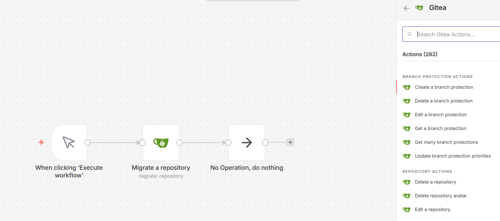

# n8n-nodes-gitea-full
[English README](README.md)

这是一个 n8n 社区节点，提供了与 [Gitea](https://gitea.io/) 的全面集成。它实现了与 Gitea 1.25 版本兼容的所有 API 接口，允许您在 n8n 工作流中自动化 Gitea 实例的几乎所有功能。

**免责声明**：这是一个非官方的社区节点。它不隶属于 Gitea 或 Gitea 项目，也未获得其认可或与其有关联。本项目中使用的 Gitea Logo 和商标均为其各自所有者的财产。

[n8n](https://n8n.io/) 是一款基于公平代码许可（fair-code licensed）的工作流自动化平台。



## 功能特性

此节点涵盖了广泛的 Gitea 资源：

- **Repository (仓库)**：增删改查、迁移、搜索、分支管理、分支保护、协作者管理、提交历史。
- **Issue (任务)**：完整的任务管理，包括评论、标签、里程碑、依赖关系、阻塞设置、秒表计时、已记录时间、订阅管理、表情反应（Reactions）和附件。
- **Organization (组织)**：管理组织、成员、团队及组织级仓库。
- **User (用户)**：管理个人配置、公开/GPG 密钥、黑名单、邮箱、粉丝/关注、Webhooks 和 OAuth2 应用。
- **Package (软件包)**：支持 Gitea 软件包注册表（包括 Container, NPM, Maven, PyPI, Go 等）。
- **Notification (通知)**：查看并管理通知线程。
- **Admin (管理员)**：系统级管理，包括 Cron 任务、系统钩子、用户/组织管理及未收编仓库处理。
- **Repository Actions (Actions)**：管理 Gitea Actions 的附件、作业（Jobs）、运行记录（Runs）、Runner、密钥（Secrets）和变量。
- **ActivityPub**：基础 ActivityPub 协议支持。
- **Miscellaneous (杂项)**：Markdown/Markup 渲染、各类模板（gitignore, 标签, 许可）及系统信息查询。

## 安装

### 通过 n8n 界面
1. 前往 **Settings > Community Nodes**。
2. 点击 **Install a next node**。
3. 在 **Enter npm package name** 输入框中输入 `n8n-nodes-gitea-full`。
4. 确认风险并点击 **Install**。

### 通过 命令行
对于基于 Docker 的安装：
```bash
npm install n8n-nodes-gitea-full
```

## 凭证设置

要使用此节点，您需要一个 Gitea API 令牌：

1. 登录您的 Gitea 实例。
2. 前往 **设置 > 应用**。
3. 在 **管理访问令牌** 下，输入名称并点击 **生成令牌**。
4. 复制生成的令牌。
5. 在 n8n 中，创建一个新的 **Gitea API** 凭证，并粘贴您的 **Base URL** (例如 `https://gitea.com`) 和 **Access Token**。

## 兼容性

- 针对 Gitea 1.25 版本开发并测试。
- 需要 n8n 1.0.0 或更高版本。

## 相关资源

- [Gitea API 文档](https://docs.gitea.com/api/1.25/)
- [GitHub 仓库](https://github.com/sungaowei/n8n-nodes-gitea)
- [n8n 社区节点文档](https://docs.n8n.io/integrations/community-nodes/)

## 许可

[MIT](LICENSE)
